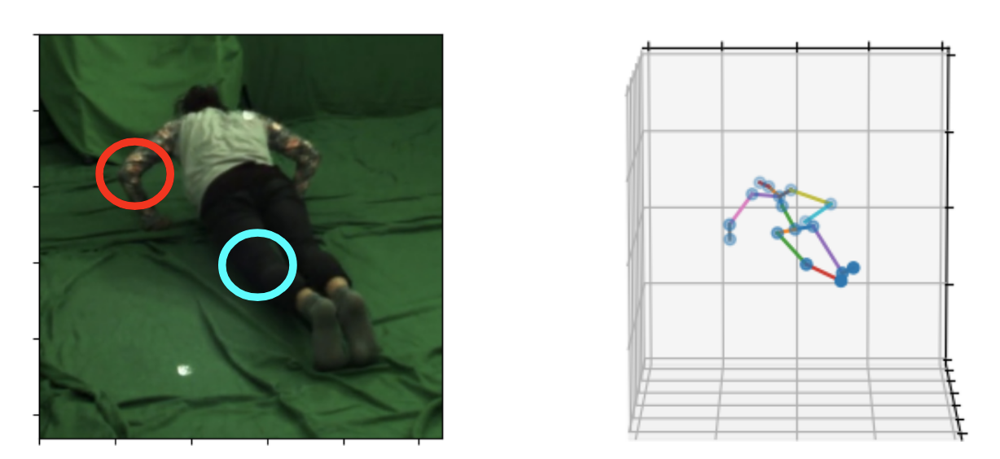
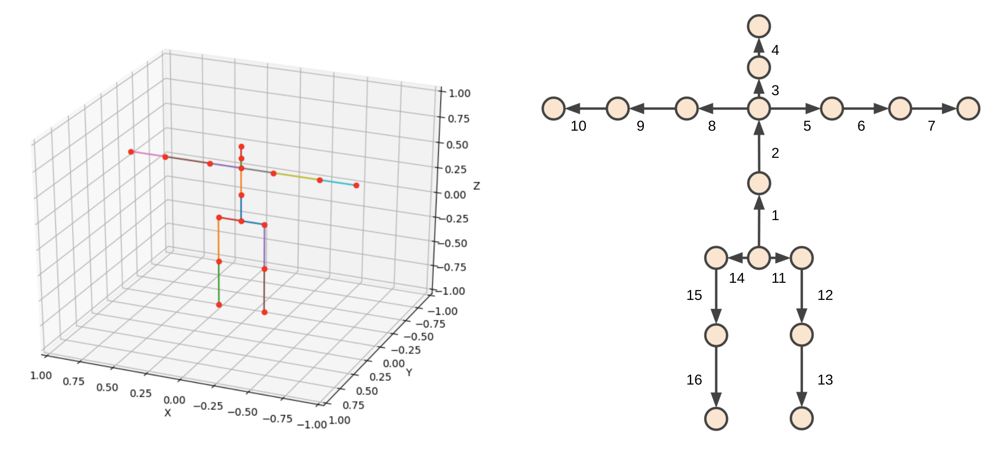
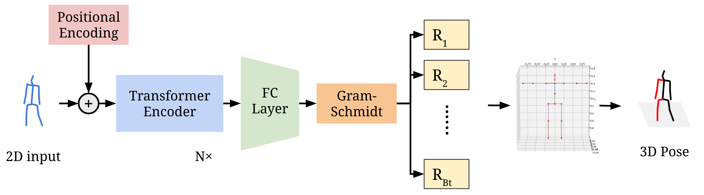

## Conventional Human Pose Estimation

Modern works take 3D pose estimation as a coordinate regression problem, which neglects the human body kinematics and often leads to unrealistic results. 

In other words, they only regress the coordinates of body joints and does not take account of the structured dependency between keypoints.
An example of kinematically unrealistic output.

Red circle: left lower arm does not have the same length with right counterpart;
cyan circle: knee joint has a unrealistic rotation to the right.

For example, we consider a simulation scenario where controlling a fix-sized avatar takes place. 
An accurate and realistic pose is a prerequisite to simulation applications.
However, pure joint detection struggles to map a single pose to different avatars as every human skeleton has different shape, hence different joint positions.
Designing a pipeline that can digest pose information regardless of object's height or shape and guarantees kinematically realistic outputs is a less researched and overlooked topic.

## Human Model

 Human kinematic model in 3D view (left) and the order of bone vectors (right)
 
 (1.  lower spine; 2.  upper spine; 3.  neck; 4.  head; 5.  left clavicle; 6.  left upper arm; 7.  left lower arm; 8.  right clavicle; 9. right upper arm; 10. right lower arm; 11. left pelvis; 12. left thigh; 13. left calf; 14. right pelvis; 15.right thigh; 16. right calf )

## Architecture of PEBRT

The pipeline takes in a single 2D pose as input, feeds it through N layers of Transformer Encoders followedby a linear layer.  

Gram-Schmidt process is applied to the linear layer output to recover rotation matrices foreach bone. The rotation matrices are applied to our human model for the final 3D pose

## New evaluation metrics
We propose a new metric, called Mean Per Bone Vector Error (MPBVE), that assess the pose similarity indepedent from human body shape, age, or gender.
