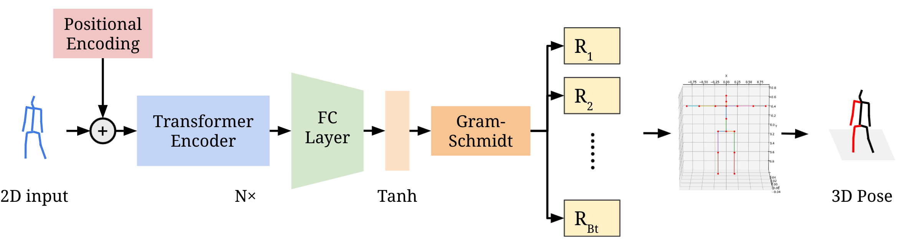
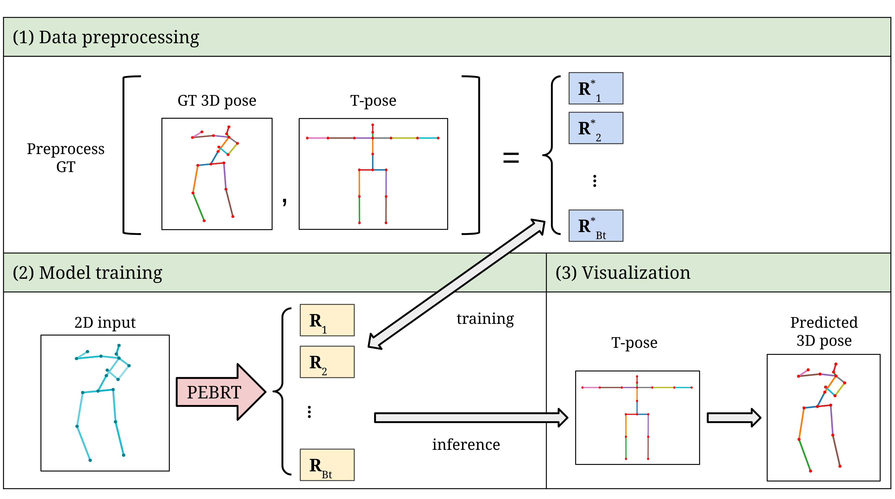
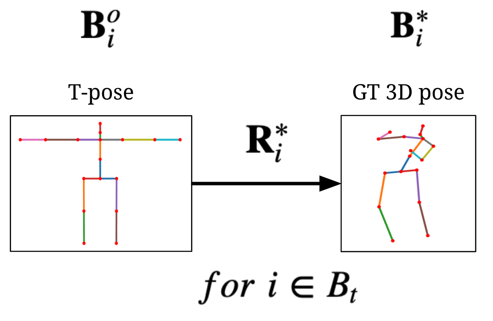
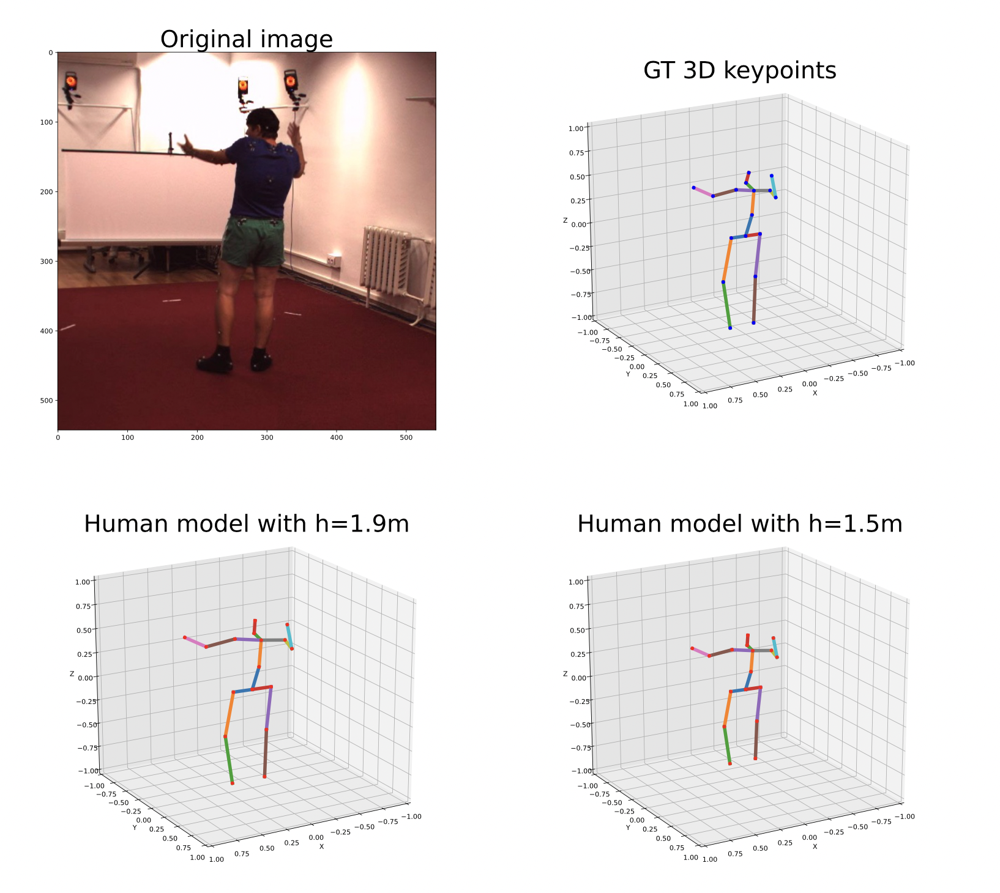
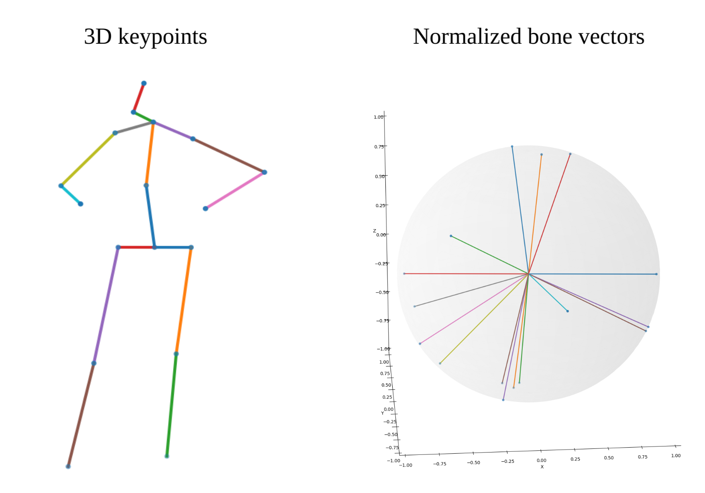

## Conventional Human Pose Estimation

Modern works take 3D pose estimation as a coordinate regression problem, which neglects the human body kinematics and often leads to unrealistic results. 

In other words, they only regress the coordinates of body joints and does not take account of the structured dependency between keypoints.
An example of kinematically unrealistic output.

Red circle: left lower arm does not have the same length with right counterpart;
cyan circle: knee joint has a unrealistic rotation to the right.

For example, we consider a simulation scenario where controlling a fix-sized avatar takes place. 
An accurate and realistic pose is a prerequisite to simulation applications.
However, pure joint detection struggles to map a single pose to different avatars as every human skeleton has different shape, hence different joint positions.
Designing a pipeline that can digest pose information regardless of object's height or shape and guarantees kinematically realistic outputs is a less researched and overlooked topic.

## Human Model

 Human kinematic model in 3D view (left) and the order of bone vectors (right)
 
 (1.  lower spine; 2.  upper spine; 3.  neck; 4.  head; 5.  left clavicle; 6.  left upper arm; 7.  left lower arm; 8.  right clavicle; 9. right upper arm; 10. right lower arm; 11. left pelvis; 12. left thigh; 13. left calf; 14. right pelvis; 15.right thigh; 16. right calf )

## Architecture of PEBRT

The pipeline takes in a single 2D pose as input, feeds it through N layers of Transformer encoders followed by a linear layer and tanh activation function.  

Gram-Schmidt process is applied to the linear layer output to recover rotation matrices foreach bone. The rotation matrices are applied to our human model for the final 3D pose

## Overview

During data preprocessing in (1), a given GT 3D pose is used to obtain rotation matrices for each bone taking T-pose as reference. Gram-Schmidt process is applied to the network output, where the GT rotation matrices are used to calculate MAEV loss during training (2), where i stands for i−th bone. 
Finally in (3), the predicted rotation matrices are applied to a T-pose human model that rotates each bone accordingly during inference. Details of each step are given in the following sections.

Rotation matrices are applied to each bone in the human model to make the pose.

To verify whether the method is functional, we load an image with its corresponding GT 3D keypoints, with which GT rotation matrices can be inferred. 
The GT rotation matrices are applied to our human model with height set to 1.5m and 1.9m.

## New evaluation metrics
We propose a new metric, called Mean Per Bone Vector Error (MPBVE), that assess the pose similarity indepedent from human body shape, age, or gender.

To implement this metric on given 3D keypoints, the following procedures are applied
1. Vectorize - obtain bone position vectors based on a predefined order
2. Normalize - normalize each vector to 1m