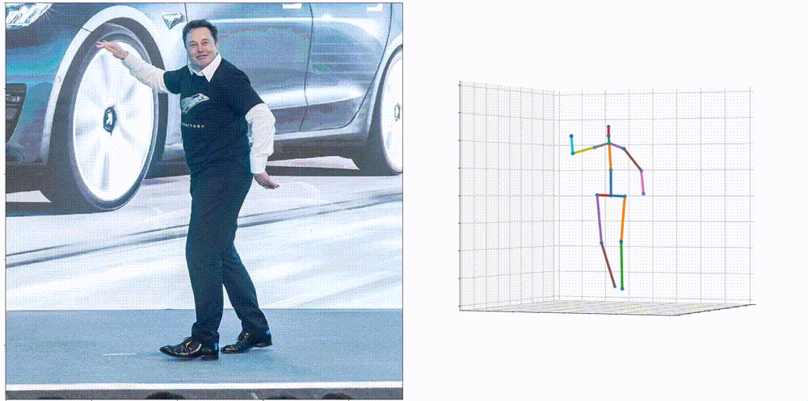

# One pose fits all

This repository contains files used in the thesis done by Yen-Lin Wu in partial fulfillment of his MSc programme in Mechanical Engineering at Delft University of Technology (2021), supervised by Osama Mazhar and Jens Kober. 

This branch is an implementation of PETR.
To run PEBRT, please check out branch 'gram'.

## PETR (Pose Estimation using TRansformer)

PETR is an end-to-end lifting pipeline used to predict human 3D keypoints from RGB images.
It uses pre-trained [HRNet](https://github.com/HRNet/HigherHRNet-Human-Pose-Estimation) as backbone and could be later finetuned.

<p align="center"></p>
<p align="center"></p>


## Getting started

Make sure there is 200GB on local hard drive in order to save the original dataset and its processed frames.

### Installation

Clone the repository and install required modules.
```
git clone https://github.com/wuyenlin/thesis
cd thesis/
pip3 install -r requirements.txt
```

### Pretrained Weight

The pretrained weight of HRNet is only required when running PETR.
```
mkdir weights && cd weights/
```
The pretrained weight of HRNet can be downloaded from their official GitHub page [here](https://github.com/leoxiaobin/deep-high-resolution-net.pytorch). 
The weight used in this project is "pose_hrnet_w32_256x192.pth".
Download it and place it in the `weights` folder.

## Evaluation on pre-trained models
Run 
```
python3 main.py --eval --resume ./checkpoint/weight.bin
```


## Training from scratch
To start training the model, run
```
python3 main.py
```

If you are running on a SLI enabled machine or computing cluster, run the following Pytorch DDP code (example of using 2 GPUs):
```
python3 -m torch.distributed.launch --nproc_per_node=2 --nnodes=1 cluster.py
```


- [x] Animate results (see animation.py)
- [x] Create evaluation metrics for bone rotation error
- [x] Add kinematic constraints
- [x] Train and test on Human3.6M
- [x] Run on distributed systems (for SLI)
- [x] Test evaluation metrics on existing methods
- [x] Fix camera angle issue / add 3D joint position in loss 