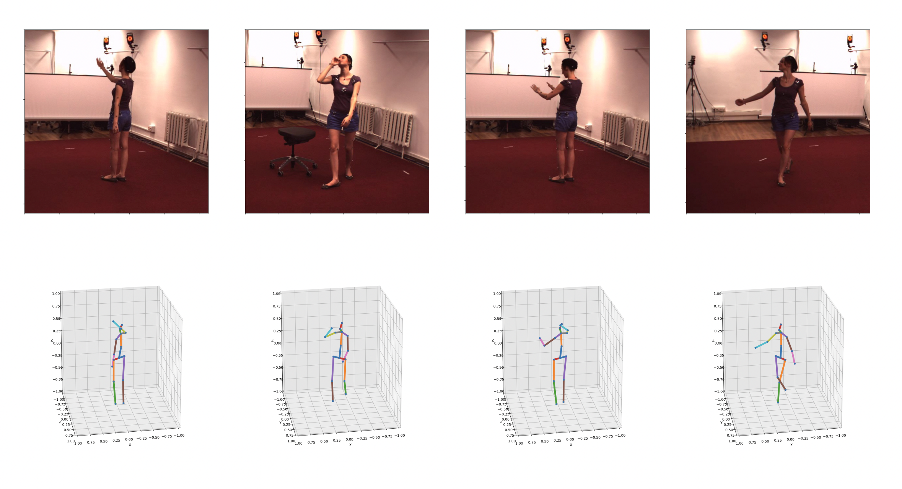

# One pose fits all

[](https://colab.research.google.com/drive/1sg6F8p_DDdoZzGMaCLRjk05vXxlI9wlv?usp=sharing)


This repository contains files used in the thesis done by Yen-Lin Wu in partial fulfillment of his MSc programme in Mechanical Engineering at Delft University of Technology (2021), supervised by Osama Mazhar and Jens Kober. 
Thesis is available [here](http://resolver.tudelft.nl/uuid:8bcc7171-404e-4bb6-b2e2-e5877f5607d6).

The thesis aims to address the widely challenged computer vision task - 3D Human Pose Estimation. 
Different from most existing methods, we propose a novel estimating technique that discards convolutional layers, using only Transformer layers.
On top of that, we integrate a human kinemtic model that encapsulates bone length and joint angle constraints to improve prediction accuracies.
We also propose a new evaluation metric, Mean Per Bone Vector Error (MPBVE), that focuses on human postures, independent of human body shape, age, or gender.

<p align="center"></p>

## PEBRT (Pose Estimation by Bone Rotation using Transformer)

PEBRT estimates rotation matrix parameters for each bone which are applied to a human kinematic model.
Each rotation matrix is recovered by Gram-Schmidt orthogonalization proposed by [Zhou et al.](https://openaccess.thecvf.com/content_CVPR_2019/papers/Zhou_On_the_Continuity_of_Rotation_Representations_in_Neural_Networks_CVPR_2019_paper.pdf).

For details of implementation please refer to [`DOCUMENTATIONS.md`](DOCUMENTATIONS.md).


## Quick start
Clone the repository and install required dependencies to proceed.
```
git clone https://github.com/wuyenlin/pebrt
cd pebrt/
pip3 install -r requirements.txt
```

### Dataset setup
This instruction only focuses on the setup of Human3.6M.
For dataset setup, please refer to [`DATASETS.md`](DATASETS.md).
While MPI-INF-3DHP can be used to train, the evaluation on their test set is not implemented here.


### Evaluation our pre-trained models
Download pre-trained models from [Google Drive](https://drive.google.com/drive/folders/1OYqnEO28A0Ft5XAw4YeBzkK9NNOknZqh?usp=sharing).
For example, to run evaluation on 4 layers of Transformer encoders:
```
python3 lift.py --num_layers 4 --eval --checkpoint /path/to/all_4_lay_epoch_latest.bin
```


### Training from scratch
To start training the model with 1 layer of Transformer Encoder, run
```
python3 lift.py --num_layers 1
```

If you are running on a SLI enabled machine or computing cluster, run the following Pytorch DDP code (example of using 2 GPUs):
```
python3 -m torch.distributed.launch --nproc_per_node=2 --nnodes=1 lift.py
```

## Animate results

With (pre-)trained weights, you can visualize and animate the results on our huan model using the code below.
Run the following code, where `X` is the number of Transformer encoder layer:
```
python3 animation.py --checkpoint /path/to/weights/ --num_layers X --bs 64
```
The output looks something like below.

<p align="center"></p>


### TODO
- [x] Animate results (see animation.py)
- [x] Create evaluation metrics for bone rotation error
- [x] Add kinematic constraints
- [x] Train and test on Human3.6M
- [x] Run on distributed systems (for SLI)
- [x] Added human model for both Human3.6M and MPI-IND-3DHP datasets
- [x] Fix camera angle issue / add 3D joint position in loss 
- [x] Test evaluation metrics on existing methods
- [ ] Finish dataset setup instruction for MPI
- [ ] Complete Documentations
- [ ] Add instructions for animation
- [ ] Add MPBVE table
- [ ] Separate human model configurations into yaml files