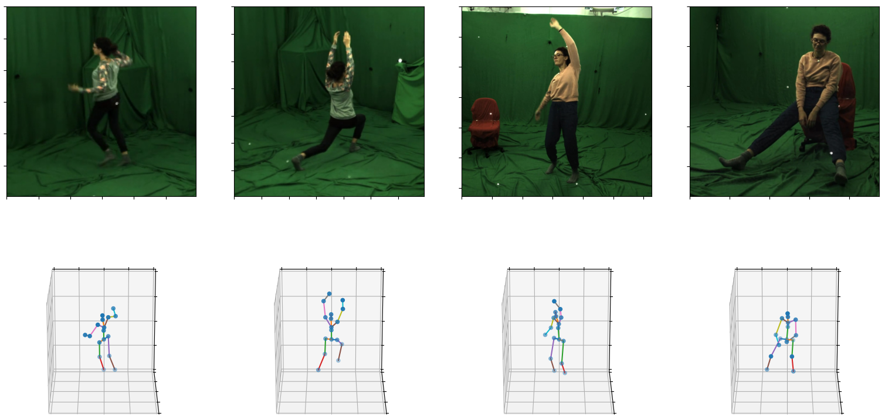

# One-pose-fits-all

This repository contains files used in the thesis done by Yen-Lin Wu in partial fulfillment of his MSc programme in Mechanical Engineering at Delft University of Technology (2021), supervised by Osama Mazhar and Jens Kober. 

The thesis aims to address the widely challenged computer vision task - 3D Human Pose Estimation. 
Different from most existing methods, we propose a novel estimating technique that discards convolutional layers, using only Transformer layers.
On top of that, we integrate human kinemtic constraints to improve prediction accuracies and proposed a new evaluation metric that focuses on human postures, independent of human body shape, age, or gender.


## PEBRT (Pose Estimation by Bone Rotation using Transformer)

PEBRT estimates rotation matrix parameters for each bone which are casted to a human kinematic model.
Each rotation matrix is recovered by Gram-Schmidt orthogonalization.


## PETR (Pose Estimation using TRansformer)

PETR is an end-to-end lifting pipeline used to predict human 3D keypoints from RGB images.
It uses pre-trained [HRNet](https://github.com/HRNet/HigherHRNet-Human-Pose-Estimation) as backbone and could be later finetuned.




## Getting started

Make sure there is 200GB on local hard drive in order to save the original dataset and its processed frames.

### Installation

Clone the repository and install required modules.
```
git clone https://github.com/wuyenlin/thesis
cd thesis/
pip3 install -r requirements.txt
```

### Pretrained Weight

The pretrained weight of HRNet is only required when running PETR.
```
mkdir weights && cd weights/
```
The pretrained weight of HRNet can be downloaded from their official GitHub page [here](https://github.com/leoxiaobin/deep-high-resolution-net.pytorch). 
The weight used in this project is "pose_hrnet_w32_256x192.pth".
Download it and place it in the `weights` folder.

### Download dataset

### 1. MPI-INF-3DHP
The MPI-INF-3DHP dataset can be downloaded [here](http://gvv.mpi-inf.mpg.de/3dhp-dataset/).

After downloading the dataset, run the following command to extract frames and create `.npz` files for each character:
```
python3 common/mpi_dataset.py
```

### 2. Human3.6M
1. Download the Human3.6M dataset from their [official website](vision.imar.ro/human3.6m/) and follow the setup from [VideoPose3D](https://github.com/facebookresearch/VideoPose3D/blob/master/DATASETS.md) to create `data_2d_h36m_gt.npz` and `data_3d_h36m.npz`.

or

2. Download 2D detection files for Human3.6M from the same [page](https://github.com/facebookresearch/VideoPose3D/blob/master/DATASETS.md).

After downloading the files, your directory should look like this:
```
```
Now, run the following command to extract video frames and merge 2D/3D annotations into one single `.npz` file.
```
python3 common/h36m_dataset.py
```

## Evaluation on pre-trained models
Run 
```
python3 main.py --eval --resume ./checkpoint/weight.bin
```


### New evaluation metrics


## Training from scratch
To start training the model, run
```
python3 lift.py
```

If you are running on a SLI enabled machine or computing cluster, run the following Pytorch DDP code (example of using 2 GPUs):
```
python3 -m torch.distributed.launch --nproc_per_node=2 --nnodes=1 cluster.py
```


- [x] Animate results (see animation.py)
- [x] Create evaluation metrics for bone rotation error
- [x] Add kinematic constraints
- [x] Train and test on Human3.6M
- [x] Run on distributed systems (for SLI)
- [x] Added human model for both Human3.6M and MPI-IND-3DHP datasets
- [ ] Separate human model configurations into yaml files
- [ ] Test evaluation metrics on existing methods (working on it now)
- [ ] Online implementations of PETR (training & finetuning now)
- [ ] Fix camera angle issue / add 3D joint position in loss 